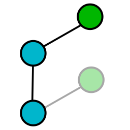

# Autorebase




I work on a repo with a fast-moving `master` branch and it gets pretty tedious typing

```
git switch master
git pull
git switch add_tests
git rebase master
git switch implement_feature
git rebase master
git switch implement_another_feature
git rebase master
git switch fix_bug
git rebase master
...
```

This program tries to do that for you. If there's a conflict it tries to rebase the branch as far as it can without conflicts. It's sort of finished.

## Installation

Download a binary release from the Github releases page, or you can compile this using `cargo`.

## Usage

Simply run `autorebase` in your repo. This will perform the following actions

1. Update `master`, by pulling it with `--ff-only` unless you have it checked out.
2. Create a temporary work tree inside `.git/autorebase` (this is currently never deleted but you can do it manually with `git worktree remove autorebase_worktree`).
3. Get the list of branches that have no upstream, and aren't checked out.
4. For each branch:
  1. Try to rebase it onto `master`.
  2. If that fails due to conflicts, abort and try again for the previous commit.
  3. Keep retrying until we get to not rebasing at all.
  4. If we didn't manage to rebase all the way to `master`, then mark the branch as "stuck" so it isn't attempted in future. To "unstick" it, rebase manually or add more commits to the branch.

Full usage is:

    autorebase [--onto <target_branch>]

`<target_branch>` is `master` by default. If you develop on `develop` you probably want `autorebase --onto develop`.

## Limitations

* It probably won't be able to rebase branches that aren't trees, i.e. branches that contain merge commits. I haven't tested this.
* It does everything by running `git` on the command line rather than through a library like `libgit2`, which probably isn't super robust.
* There's no way to manually specify which branches to rebase. I may add something like `autorebase track my_branch` at some point. Maybe.
* It can't rebase checked out branches. This is a limitation of `git worktree`.
* It can't pull `master` if it is checked out.

It's possible to solve do the latter two limitations simply by doing the rebase/pull in the worktree where they are checked out (probably only the tree is clean) but I haven't done it yet. I'll see how annoying it is.
