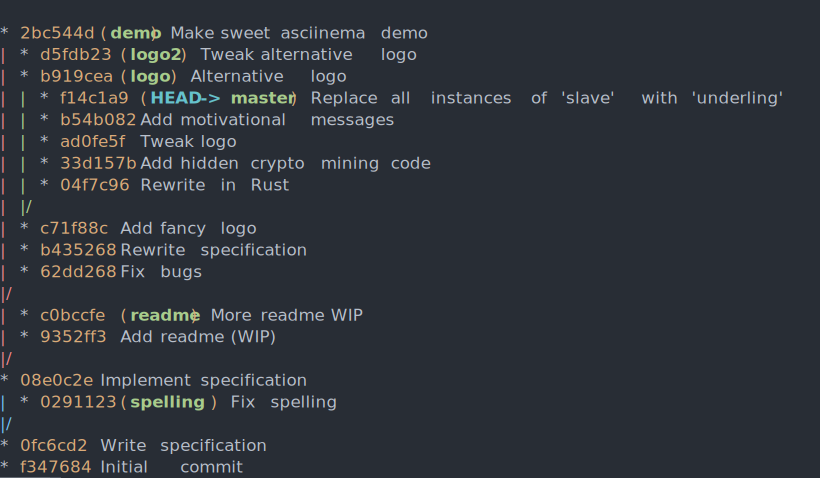
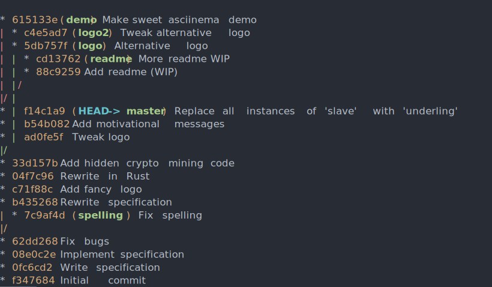

# Autorebase

Autorebase automatically rebases all of your feature branches onto `master`. If conflicts are found it will rebase to the last commit that doesn't cause conflicts. Currently it will rebase all branches that don't have an upstream. You don't need to switch to any branch, the only limitation is that a branch that is checked out and not clean will not be rebased (though I may add that in future).

Here is a demo. Before autorebase we have a number of old feature branches.

Let's `autorebase`!

This has attempted to rebase all of the branches. `demo` and `readme` were successfully rebased onto `master`. However the other branches had conflicts, so they were not rebased all the way to `master`. Instead they were rebased to just before the commit that caused the conflicts.

If a commit couldn't be fully rebased due to conflicts, it is marked as such and rebasing it won't be attempted again until its commit hash changes (e.g. to being edited or manually rebased).

## Installation

Download a binary release from [the Github releases page](https://github.com/Timmmm/autorebase/releases), or you can run

    cargo install autorebase

## Usage

Just run `autorebase` in your repo. This will perform the following actions

1. Update `master`, by pulling it with `--ff-only` unless you have it checked out with pending changes.
2. Create a temporary work tree inside `.git/autorebase` (this is currently never deleted but you can do it manually with `git worktree remove autorebase_worktree`).
3. Get the list of branches that have no upstream, and aren't checked out with pending changes.
4. For each branch:
    1. Try to rebase it onto `master`.
    2. If that fails due to conflicts, abort and try to rebase it as far as possible. There are two strategies for this (see below).
    3. If we didn't manage to rebase all the way to `master`, then mark the branch as "stuck" so it isn't attempted in future. To "unstick" it, rebase manually or add more commits to the branch.

Full usage is:

    autorebase [--slow] [--onto <target_branch>]

`<target_branch>` is `master` by default. If you develop on `develop` you probably want `autorebase --onto develop`.

There are two conflict detection strategies. The default is fast; `--slow` selects the slow method. The slow method simply tries rebasing onto `master^`, `master^^`, `master^^^` and so on until one works or we get to the merge base.

The fast method tries to rebase `master` onto the feature branch. It counts how many commits succeed, and assumes that these ones don't conflict, and the next commit must be the offending one. Then it aborts the rebase and rebases the feature branch to just before that commit.

The slow method is reliable but slow. The fast method is fast but may be suboptimal in some case, for instance if a conflict is only introduced temporarily.

## Limitations

* It probably won't be able to rebase branches that aren't trees, i.e. branches that contain merge commits. I haven't really tested this.
* It does everything by running `git` on the command line rather than through a library like `libgit2`, which probably isn't super robust.
* There's no way to manually specify which branches to rebase. I may add an interface like `autorebase track my_branch` at some point. Maybe.
* `autorebase`'s worktree is never deleted so it uses up some disk space forever. You can delete it manually if you like.
* Limited testing!
